# iOS Deployment Guide
> This guideline is used to guide you how to deploy an App to AppleStore.

---

## Build Preparation

First of all, you will need the following certificates or stuff to sign or build an App.

1. [iOS Distribution Certificate](#distribution-certificate)
2. [Your own developer certificate](#developer-certificate)
3. [App Identifier](#app-identifier)
4. [A valid testing devices](#register-testing-devices)
5. [Development Provisioning Profile and Production Provisioning Profile](#provisioning-profiles)

---

### Distribution Certificate

1. Login to [Apple Developer](https://developer.apple.com)
2. Goto [Certificates, Identifiers & Profiles](https://developer.apple.com/account/resources/certificates/list)
3. Click `Certificates` tag
4. Find the `iOS Distribution` and download the certificate

---

### Developer Certificate

1. Login to [Apple Developer](https://developer.apple.com)
2. Goto [Certificates, Identifiers & Profiles](https://developer.apple.com/account/resources/certificates/list)
3. Click `Certificates` tag
4. Click `+`
5. ↓ Select `Apple Development` and continue
> 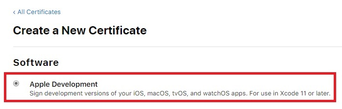
6. Follow this [instruction](https://help.apple.com/developer-account/#/devbfa00fef7) to generate a `CSR file`
7. ↓ Choose the `CSR file`
> 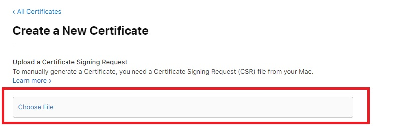
8. Download the developer certificate and open it

---

### App Identifier

1. Login to [Apple Developer](https://developer.apple.com)
2. Goto [Certificates, Identifiers & Profiles](https://developer.apple.com/account/resources/certificates/list)
3. Click `Identifiers` tag
4. Click `+`
5. ↓ Select `App IDs`
> 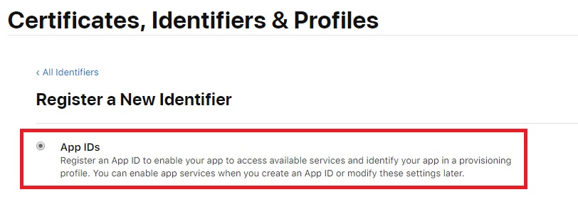
6. ↓ Complete the form by project requirements
> 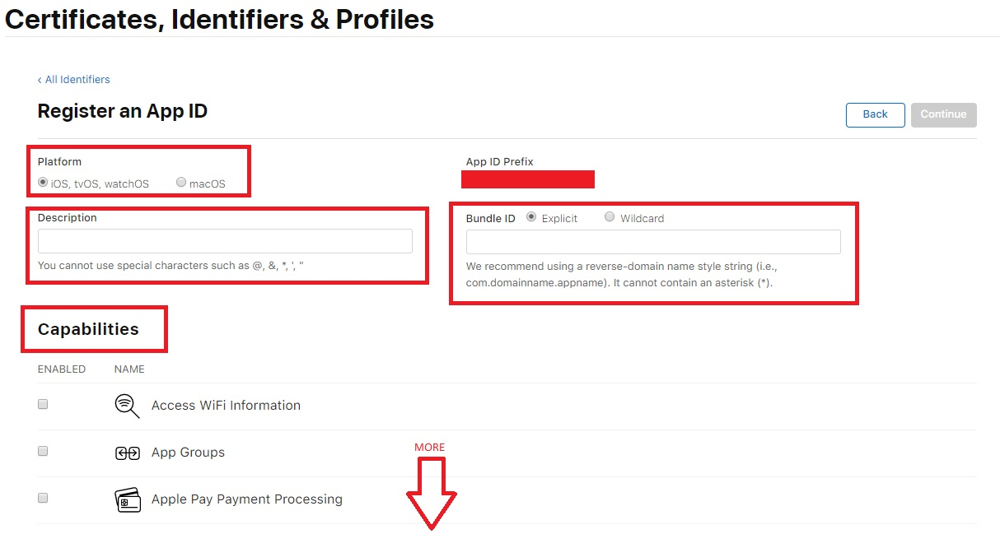
7. Continue to complete

---

### Provisioning Profiles

To seperate the `DEV` and `PROD` in build stage, we will use different profiles to sign our App.

> **Here is the table that shows the differents between `Development Profile` and `Production Profile`**
> 
> 
> | Certificate Type         | Build on valid test devices | Build on simulator  | Deploy to TestFlight | Deploy to Store|
> | ------------------------ |:---------------------------:|:-------------------:|:--------------------:|:--------------:|
> | Development Profile      |              O              |          O          |           X          |        X       |
> | Production Profile       |              O              |          O          |           O          |        O       |

#### Development Profile

1. Login to [Apple Developer](https://developer.apple.com)
2. Goto [Certificates, Identifiers & Profiles](https://developer.apple.com/account/resources/certificates/list)
3. Click `Profiles` tag
4. Click `+`
5. ↓ Select `iOS App Development` under `Development` section and continue
> 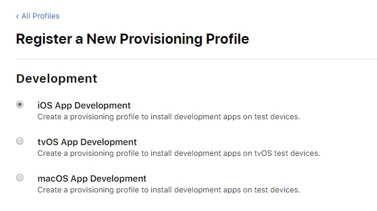
6. ↓ Select the `App ID` which you created in the previous step and continue
> 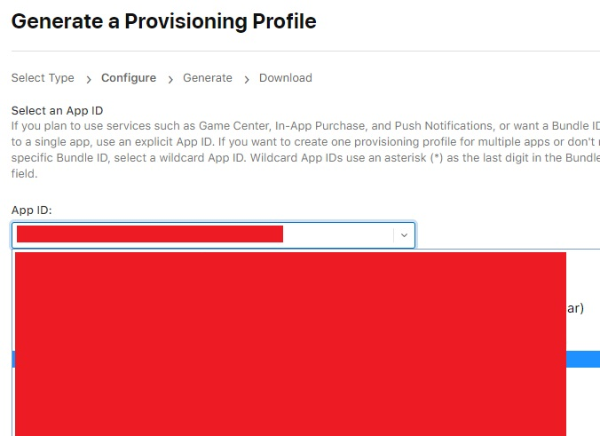
7. ↓ Select who can use this profile to sign App and continue
> 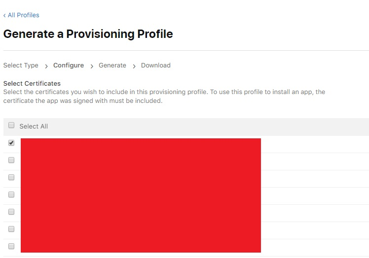
8. Name it and continue
> 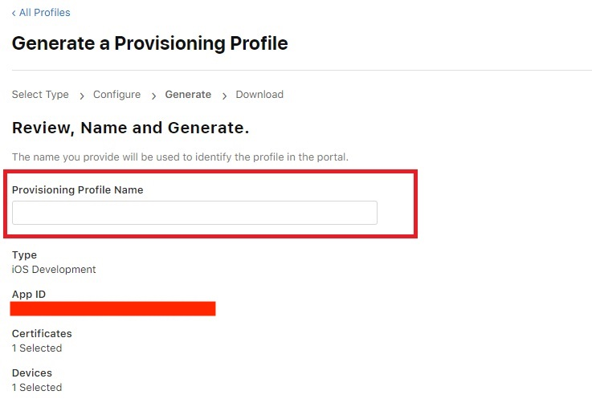
9. Download and open it

#### Production Profile

1. Login to [Apple Developer](https://developer.apple.com)
2. Goto [Certificates, Identifiers & Profiles](https://developer.apple.com/account/resources/certificates/list)
3. Click `Profiles` tag
4. Click `+`
5. ↓ Select `App Store` under `Distribution` section and continue
> 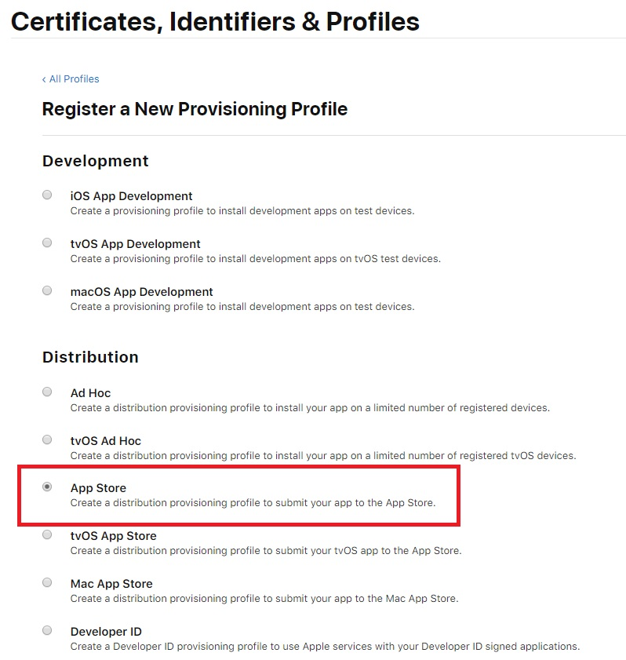
6. ↓ Select the `App ID` which you created in the previous step and continue
> 
7. ↓ Select `iOS Distribution Certificate` (should be `ONLY ONE` certificate here, if not please find senior programmer for help)
> 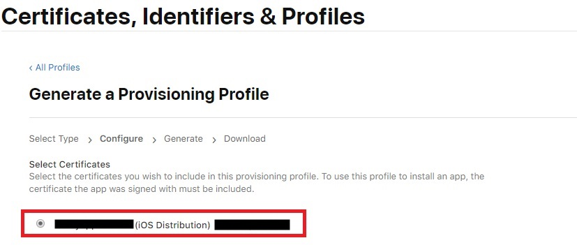
8. Name, generate, download and open it
> 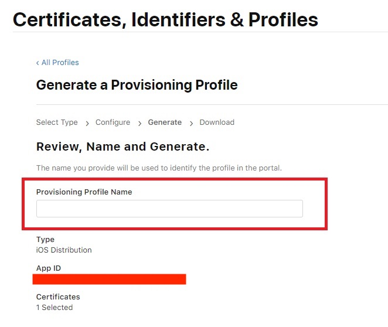

---

## Build Steps

Then, you will need to follow these steps to build an App:

1. Download [iOS Distribution Certificate](#distribution-certificate), [Developer Profile](#developer-profile) and [Production Profile](#production-profile) and  and store those certificates and profiles into your `Keychain Access`
2. Ready a iTunes Connect App
3. Setup XCode
 - Type the correct bundle identifier
 - Select the correct signing certificates for debug and release
4. Select `Generic iOS Device` in XCode
5. Select `Product > Archive`

---

## Deploy Steps

After that, you can select your archived binary to upload to the iTunes Connect for TestFlight or ready to release.

1. Open `Organizer` by selecting `Windows > Organizer`
2. Select your App from left bar
3. Select your build
4. Click `Distribute App`
5. Pick `iOS App Store` and next
6. Select `Upload` and next
7. Select correct the [iOS Distribution Certificate](#distribution-certificate) and [Production Profile](#production-profile)
8. Upload to iTunes Connect